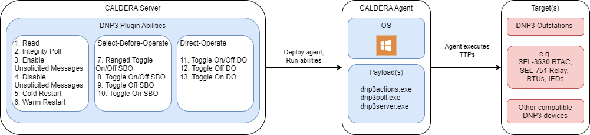

# DNP3

DNP3 (Distributed Network Protocol 3) Protocol Threat Emulation Tooling

## Overview

The DNP3 plugin provides adversary emulation abilities specific to the DNP3 protocol.  The standard, IEEE Std 1815, for the DNP3 protocol requires [DNP Users Group](https://www.dnp.org/) membership to access. For a basic technical overview see "A DNP3 Protocol Primer" [referenced here](#additional-resources).

The following table outlines MITRE ATT&CK for ICS Tactic coverage provided by the DNP3 plugin:

|Collection                |Inhibit Response Function |Impact
:--------------------------|:-------------------------|:-
|Automated Collection      | Block Reporting Message  | Manipulation of Control
|Point & Tag Identification| Device Restart/Shutdown  |

### Compatibility
The plugin payload(s) currently support deployment to Caldera agents for the following computer architectures:
|      |Windows |Linux | Macintosh
------:|:------:|:----:|:--------:
|32-bit|        |      |
|64-bit| **X**  |      |

* The windows payload was compiled with Windows 10 v21H2 using VSCode v1.67.1 with CMake v3.26.4.

### Ability Overview Tables
The following tables list each plugin ability by their corresponding tactic. A heatmap of plugin abilities is available to view [here](assets/heatmap.PNG).

#### **Collection Abilities** 

| Name 	                | Tactic 	        | Technique |  Technique ID     |
|---------              |---------	        |---------	|---------	        |
| [DNP3 Read](#read)             | Collection       	| Automated Collection  |  T0802    |
| [DNP3 Integrity Poll](#integrity-poll)   | Collection      	| Point & Tag Identification |  T0861    |
| [DNP3 Enable Unsolicited Messages](#enable-unsolicited-messages) | Collection |  Automated Collection  | T0802    |

#### **Inhibit Response Function Abilities**

| Name 	                | Tactic 	        | Technique |  Technique ID     |
|---------              |---------	        |---------	|---------	        |
| [DNP3 Cold Restart](#cold-restart)     | Inhibit Response Function | Device Restart/Shutdown   |  T0816 |
| [DNP3 Warm Restart](#warm-restart)     | Inhibit Response Function | Device Restart/Shutdown   |  T0816 |
| [DNP3 Disable Unsolicited Messages](#disable-unsolicited-messages) | Inhibit Response Function | Block Reporting Message   |  T0804 |

#### **Impact Abilities**

| Name 	                | Tactic 	        | Technique |  Technique ID     |
|---------              |---------	        |---------	|---------	        |
| [DNP3 Ranged Modulate Breaker SBO](#ranged-modulate-breaker-select-before-operate) | Impact | Manipulation of Control | T0831 |
| [DNP3 Modulate Breaker SBO](#modulate-breaker-select-before-operate) | Impact | Manipulation of Control | T0831 |
| [DNP3 Toggle OFF Breakers SBO](#toggle-off-breakers-select-before-operate) | Impact | Manipulation of Control |  T0831 |
| [DNP3 Toggle ON Breakers SBO](#toggle-on-breakers-select-before-operate) | Impact | Manipulation of Control |  T0831 |
| [DNP3 Modulate Breaker DO](#modulate-breaker-direct-operate) | Impact | Manipulation of Control | T0831 |
| [DNP3 Toggle OFF Breakers DO](#toggle-off-breakers-direct-operate) | Impact | Manipulation of Control |  T0831 |
| [DNP3 Toggle ON Breakers DO](#toggle-on-breakers-direct-operate) | Impact | Manipulation of Control |  T0831 |

## Architecture
This section describes the main components of the plugin and how they interface.

### Block Diagram

The DNP3 Plugin introduces several new abilities to the user once installed on the Caldera server. The abilities execute on the agent and can target any device that acts as a DNP3 Outstation.

Compatible targets include, but are not limited to: Schweitzer Engineering Laboratories (SEL) devices such as RTACs and Relays, among other local and remote devices and programs that respond to DNP3 data and control commands. This includes the test outstation, if it is run.

### Payloads

The DNP3 plugin leverages one primary payload based on OpenDNP3 detailed in the [libraries](#libraries) section, although three binaries from the `dnp3` src code are available for use:

Payload:
* `dnp3actions.exe`: &emsp; CLI enabling all the  DNP3 threat emulation actions (protocol functionality) described under Ability Overviews.
* `dnp3poll.exe`: &emsp; A test polling (master) application
* `dnp3server.exe`: &emsp; A test server (outstation) application

### Libraries

The following libraries were used to build the DNP3 payloads:

| Library | Version	 | License |
|---------|--------- |---------|
|opendnp3 |[3.1.2](https://github.com/dnp3/opendnp3/releases/tag/3.1.2) |[Apache](https://github.com/dnp3/opendnp3/blob/release/LICENSE)      |

## Usage

This section describes how to initially deploy and execute the abilities present within the DNP3 plugin.

### Deployment

1. Identify the target outstaton you would like to communicate with via DNP3.
2. Identify a viable host for the Caldera agent that will be sending DNP3 messages to the target system.
3. Deploy the Caldera agent to the viable host.
4. Run any(*) of the DNP3 plugin abilities listed below to achieve desired impact.

(*) Applicable toggle breaker commands will depend on the target environment (see _"Tripping the Breakers"_ underneath _Source Code_)

*Reference the Caldera training plugin for a step-by-step tutorial on how to deploy an agent and run abilities via a campaign.*

#### DNP3 Sources and Facts

The following Facts are used by DNP3 plugin abilities:

Key:
- [-] = Ability does not use this fact
- [**X**] = Ability uses this fact
- UM = Unsolicited Messages

* **Table 1** Facts specific to non-Impact Abilities

| Fact Name/Ability Used By | Read	| Intregrity Poll   | Enable UM           | Disable UM      | Warm Restart    | Cold Restart |
|---------             |---------	  |---------	        |---------	          |---------        |---------        |---------     |
| dnp3.server.id       | [**X**]        | [**X**]       | [**X**]             | [**X**]         | [**X**]         | [**X**]      |
| dnp3.server.port     | [**X**]        | [**X**]       | [**X**]             | [**X**]         | [**X**]         | [**X**]      |
| dnp3.local.link      | [**X**]        | [**X**]       | [**X**]             | [**X**]         | [**X**]         | [**X**]      |
| dnp3.remote.link     | [**X**]        | [**X**]       | [**X**]             | [**X**]         | [**X**]         | [**X**]      |
| dnp3.object.group    | [**X**]        | [-]           | [-]                 | [-]             | [-]             | [-]          |
| dnp3.object.variation| [**X**]        | [-]           | [-]                 | [-]             | [-]             | [-]          |
| dnp3.start.index     | [**X**]        | [-]           | [-]                 | [-]             | [-]             | [-]          |
| dnp3.end.index       | [**X**]        | [-]           | [-]                 | [-]             | [-]             | [-]          |
| dnp3.message.class1  | [-]            | [-]           | [**X**]             | [**X**]         | [-]             | [-]          |
| dnp3.message.class2  | [-]            | [-]           | [**X**]             | [**X**]         | [-]             | [-]          |
| dnp3.message.class3  | [-]            | [-]           | [**X**]             | [**X**]         | [-]             | [-]          |

* **Table 2** Facts specific to Impact Abilities

Additional Key:
- RM = Ranged Modulate Breaker
- MB = Modulate Breaker
- SBO = Select-before-Operate
- DO = Direct Operate

* The "Breaker" after Toggle OFF/ON is ommitted to save space

| Fact Name/Ability Used By | RMB SBO	| MB SBO | Toggle OFF SBO | Toggle ON SBO | MB DO       | Toggle OFF DO| Toggle ON DO |
|---------             |---------	    |---------  |---------	  |---------      |---------    |---------     |--------      |
| dnp3.server.id       | [**X**]       | [**X**]  | [**X**]     | [**X**]       | [**X**]     | [**X**]      |[**X**]       |
| dnp3.server.port     | [**X**]       | [**X**]  | [**X**]     | [**X**]       | [**X**]     | [**X**]      |[**X**]       |
| dnp3.local.link      | [**X**]       | [**X**]  | [**X**]     | [**X**]       | [**X**]     | [**X**]      |[**X**]       |
| dnp3.remote.link     | [**X**]       | [**X**]  | [**X**]     | [**X**]       | [**X**]     | [**X**]      |[**X**]       |
| dnp3.start.index     | [**X**]       | [-]      | [**X**]     | [**X**]       | [-]         | [**X**]      |[**X**]       |
| dnp3.end.index       | [**X**]       | [-]      | [**X**]     | [**X**]       | [-]         | [**X**]      |[**X**]       |
| dnp3.server.index    | [**X**]       | [**X**]  | [-]         | [-]           | [**X**]     | [-]          |[-]           |
| dnp3.operate.iterations    | [**X**] | [**X**]  | [-]         | [-]           | [**X**]     | [-]          |[-]           |
| dnp3.index.step  | [-]               | [-]      | [**X**]     | [**X**]       | [-]         | [-]          |[-]           |
| dnp3.trip.on     | [**X**]           | [**X**]  | [-]         | [-]           | [**X**]     | [-]          |[-]           |
| dnp3.trip.off    | [**X**]           | [**X**]  | [-]         | [-]           | [**X**]     | [-]          |[-]           |
| dnp3.on.time     | [**X**]           | [**X**]  | [-]         | [-]           | [**X**]     | [-]          |[-]           |
| dnp3.off.time    | [**X**]           | [**X**]  | [-]         | [-]           | [**X**]     | [-]          |[-]           |

#### Sample Facts - DNP3
    ...
    name: DNP3 Sample Facts
    facts:
    - trait: dnp3.server.ip
      value: '127.0.0.1'
    - trait: dnp3.server.port
      value: 20000
    - trait: dnp3.local.link
      value: 1
    - trait: dnp3.remote.link
      value: 10
    ...

Read more about [facts](https://caldera.readthedocs.io/en/latest/Basic-Usage.html?highlight=fact#facts) in the Caldera documentation.

#### Trip Codes
The Trip Close codes when pulsing the breaker are mapped as follows:
* NUL = 0
* CLOSE = 1
* TRIP = 2

In some Abilities, the command has included a hard-coded trip code, for example:
* `Select-before-Operate Pulse On` has `-t 1` (CLOSE)
* `Select-before-Operate Pulse Off` has `-t 2` (TRIP)

If you are unsure what trip codes are used within your enviroment, one recommendation is to capture traffic when issuing a valid command. For example, examining a pcap taken using Wireshark.

#### Additional Resources:
Here is a small selection of resources to aid in understanding of the DNP3 protocol. You may already have more specific specification documents, vendor manuals, and other resources to assist with understanding the state of your target environment.

* ["A DNP3 Protocol Primer" (DNP3 Users Group)](https://www.dnp.org/Portals/0/AboutUs/DNP3%20Primer%20Rev%20A.pdf)
* ["Technical Note: DNP3 & Control Relay Output Block Command" (Kepware)](https://www.kepware.com/getattachment/ae44d711-0ccb-4cf3-b1e5-6a914bd9b25e/DNP3-Control-Relay-Output-Block-Command.pdf)
  * Explains the different combinations of OperateType, TripCloseCode, and Clear bits

### Abilities

#### Read

    DNP3 Function Code 1 (0x01) READ

    Send a command to an outstation requesting data specified by the objects in the message.

    Usage: dnp3actions.exe <string> -p <int> 
             <int> <int> read --group <int> --variation <int> --start <int> --end <int>
    Arguments:
      ip-address: The IP address of the outstation to read from.
      port: The port number on the outstation to read from.
      local-link-address: The link layer address of the local DNP3 client.
      remote-link-address: The link layer address of the remote DNP3 outstation.
      read: Read subcommand.
      group: The object group of the indicies to read from.
      variation: The object variation of the indicies to read from.
      start-index: The starting index from which to read from.
      end-index: The ending index from which to read from.

    Example:
       .\dnp3actions.exe 127.0.0.1 -p 20000 1 10 read --group 20 --variation 1 --start 0 --end 12

#### Integrity Poll

    DNP3 Function Code 1 (0x01) READ / GROUP 60 / VAR 1

    Send an integrity poll command to the target outstation requesting data from all classes: static Class 0 or events Class 1/2/3.

    Usage: dnp3actions.exe <string> -p <int>
             <int> <int> --remote-addr <int> poll
    Arguments:
      ip-address: The IP address of the outstation to read from.
      port: The port number on the outstation to read from.
      local-link-address: The link layer address of the local DNP3 client.
      remote-link-address: The link layer address of the remote DNP3 outstation.
      poll: Poll subcommand.

    Example:
      .\dnp3actions.exe 127.0.0.1 -p 20000 1 10 integrity-poll

#### Enable Unsolicited Messages

    DNP3 Function Code 20 (0x14) ENABLE_UNSOLICITED

    Enable the outstation to initiate unsolicited responses from points specified by the objects in the request. An unsolicited response allows for outstation self-reporting of event data.

    Usage: dnp3actions.exe <string> -p <int>
             <int> <int> enable-messages --classes <ints>
    Arguments:
      ip-address: The IP address of the outstation to control.
      port: The port number of the outstation to control.
      local-link-address: The link layer address of the local DNP3 client.
      remote-link-address: The link layer address of the remote DNP3 outstation.
      enable-messages: Enable unsolicited messages subcommand.
      classes: The message classes to enable unsolicited messages for (space-separated list).

    Example:
      .\dnp3actions.exe 127.0.0.1 -p 20000 1 10 enable-messages --classes 1 2 3

#### Disable Unsolicited Messages

    DNP3 Function Code 21 (0x15) DISABLE_UNSOLICITED

    Prevent the outstation from initiating unsolicited responses from points specified by the objects in the request. Disabling unsolicited responses can impact the timely receipt of event data.

    Usage: dnp3actions.exe <string> -p <int>
             <int> <int> disable-messages --classes <ints>
    Arguments:
      ip-address: The IP address of the outstation to control.
      port: The port number of the outstation to control.
      local-link-address: The link layer address of the local DNP3 client.
      remote-link-address: The link layer address of the remote DNP3 outstation.
      disable-messages: Disable unsolicited messages subcommand.
      classes: The message classes to disable unsolicited messages for (space-separated list).

    Example:
      .\dnp3actions.exe 127.0.0.1 -p 20000 1 10 disable-messages --classes 1 2

#### Cold Restart

    DNP3 Function Code 13 (0x0E) COLD_RESTART

    Send a command to an outstation requesting a complete reset of all hardware and software in the device.

    Usage: dnp3actions.exe <string> -p <int>
             <int> <int> cold-restart
    Arguments:
      ip-address: The IP address of the outstation to control.
      port: The port number of the outstation to control.
      local-link-address: The link layer address of the local DNP3 client.
      remote-link-address: The link layer address of the remote DNP3 outstation.
      cold-restart: Cold restart subcommand.

    Example:
      .\dnp3actions.exe 127.0.0.1 -p 20000 1 10 cold-restart

#### Warm Restart

    DNP3 Function Code 14 (0x0E) WARM_RESTART

    Send a command to an outstation requesting a reset of only portions of the device.

    Usage: dnp3actions.exe <string> -p <int>
             <int> <int> warm-restart
    Arguments:
      ip-address: The IP address of the outstation to control.
      port: The port number of the outstation to control.
      local-link-address: The link layer address of the local DNP3 client.
      remote-link-address: The link layer address of the remote DNP3 outstation.
      warm-restart: Warm restart subcommand.

    Example:
      .\dnp3actions.exe 127.0.0.1 -p 20000 1 10 warm-restart

#### Ranged Modulate Breaker Select-Before-Operate
    DNP3 Function Code 3 (0x03) SELECT
    DNP3 Function Code 4 (0x04) OPERATE

    Modulate a range of indices using the select-before-operate function code sequence.
    The first index and every other following will use Operation Type:
    Pulse Off with Trip Close Code: Close.
    The second index and every other following will use Operation Type:
    Pulse On with Trip Close Code: Open. 
    This means that if you give a start of 0 and and end of 6 then,
     0, 2, 4, 6 will be Pulse Off and 1, 3, 5, 7 will be Pulse On.

    Usage: dnp3actions.exe <string> -p <int>
             <int> <int> toggle-sbo-range [OPTIONS]
    Options:
      -h,--help                   Print this help message and exit
      --start INT REQUIRED        The starting index of breakers to toggle off.
      --end INT REQUIRED          The ending index of breakers to toggle off.
      -i,--iterations INT REQUIRED
                                  The number of iterations to toggle the breaker off an on.
      --trip-on INT:INT in [0 - 2] REQUIRED
                                  The trip close code to use when pulsing the breaker on (NUL = 0, CLOSE = 1, TRIP = 2).
      --trip-off INT:INT in [0 - 2] REQUIRED
                                  The trip close code to use when pulsing the breaker off (NUL = 0, CLOSE = 1, TRIP = 2).
      --on-time INT REQUIRED      The time in milliseconds to pulse the breaker on.
      --off-time INT REQUIRED     The time in milliseconds to pulse the breaker off.

    Arguments:
      ip-address: The IP address of the outstation to control.
      port: The port number of the outstation to control.
      local-link-address: The link layer address of the local DNP3 client.
      remote-link-address: The link layer address of the remote DNP3 outstation.
      toggle-sbo-range: Toggle breakers on/off (Select-Before-Operate) range subcommand.
      [OPTIONS]: as above

    Example:
      .\dnp3actions.exe 127.0.0.1 -p 20000 1 10 toggle-sbo-range --start 0 --end 12 --iterations 2 --trip-on 2 --trip-off 1 --on-time 500 --off-time 0

#### Modulate Breaker Select-Before-Operate
    DNP3 Function Code 3 (0x03) SELECT
    DNP3 Function Code 4 (0x04) OPERATE

    Modulate the specified breaker at a high frequency using the select-before-operate function code sequence.

    Usage: dnp3actions.exe <string> -p <int> 
             <int> <int> toggle-sbo --index <int> --iterations <int> --trip-on <int> 
                --trip-off <int> --on-time <int> --off-time <int>
    Arguments:
      ip-address: The IP address of the outstation to control.
      port: The port number of the outstation to control.
      local-link-address: The link layer address of the local DNP3 client.
      remote-link-address: The link layer address of the remote DNP3 outstation.
      toggle-sbo: Toggle breakers (select-before-operate) subcommand.
      index: The index of the breaker to toggle on and off at a high frequency.
      iterations: The number of iterations to toggle the breaker on and off.
      trip-on: The trip close code to use when pulsing the breaker on (NUL = 0, CLOSE = 1, TRIP = 2).
      trip-off: The trip close code to use when pulsing the breaker off (NUL = 0, CLOSE = 1, TRIP = 2).
      on-time: The time in milliseconds to pulse the breaker on.
      off-time: The time in milliseconds to pulse the breaker off.

    Example:
      .\dnp3actions.exe 127.0.0.1 -p 20000 1 10 toggle-sbo --index 8 --iterations 2 --trip-on 2 --trip-off 1 --on-time 500 --off-time 0

#### Toggle OFF Breakers Select-Before-Operate
    DNP3 Function Code 3 (0x03) SELECT
    DNP3 Function Code 4 (0x04) OPERATE

    Toggle OFF a range of specified breakers using the select-before-operate function code sequence.

    Usage: dnp3actions.exe <string> -p <int> 
             <int> <int> sbo-off --start <int> --end <int> --step <int> -t 1
    Arguments:
      ip-address: The IP address of the outstation to control.
      port: The port number of the outstation to control.
      local-link-address: The link layer address of the local DNP3 client.
      remote-link-address: The link layer address of the remote DNP3 outstation.
      sbo-off: Toggle breakers off (select-before-operate) subcommand.
      start-index: The starting index of breakers to toggle off.
      end-index: The ending index of breakers to toggle off.
      step: Total value to increment on each interation, between the start and end indices.

    Example:
      .\dnp3actions.exe 127.0.0.1 -p 20000 1 10 sbo-off --start 0 --end 12 --step 5 -t 1

####  Toggle ON Breakers Select-Before-Operate
    DNP3 Function Code 3 (0x03) SELECT
    DNP3 Function Code 4 (0x04) OPERATE

    Toggle ON a range of specified breakers using the select-before-operate function code sequence.

    Usage: dnp3actions.exe <string> -p <int>
             <int> <int> sbo-on --start <int> --end <int> --step <int> -t 2
    Arguments:
      ip-address: The IP address of the outstation to control.
      port: The port number of the outstation to control.
      local-link-address: The link layer address of the local DNP3 client.
      remote-link-address: The link layer address of the remote DNP3 outstation.
      sbo-on: Toggle breakers on (select-before-operate) subcommand.
      start-index: The starting index of breakers to toggle on.
      end-index: The ending index of breakers to toggle on.
      step: Total value to increment on each interation, between the start and end indices.

    Example:
      .\dnp3actions.exe 127.0.0.1 -p 20000 1 10 sbo-on --start 0 --end 12 --step 5 -t 2

#### Modulate Breaker Direct-Operate
    DNP3 Function Code 5 (0x05) DIRECT_OPERATE

    Modulate the specified breaker at a high frequency using the direct-operate function code.

    Usage: dnp3actions.exe <string> -p <int> 
             <int> <int> toggle-do --index <int> --iterations <int> --trip-on <int>
                --trip-off <int> --on-time <int> --off-time <int>
    Arguments:
      ip-address: The IP address of the outstation to control.
      port: The port number of the outstation to control.
      local-link-address: The link layer address of the local DNP3 client.
      remote-link-address: The link layer address of the remote DNP3 outstation.
      toggle-do: Toggle breakers (direct-operate) subcommand.
      index: The index of the breaker to toggle on and off at a high frequency.
      iterations: The number of iterations to toggle the breaker on and off.
      trip-on: The trip close code to use when pulsing the breaker on (NUL = 0, CLOSE = 1, TRIP = 2).
      trip-off: The trip close code to use when pulsing the breaker off (NUL = 0, CLOSE = 1, TRIP = 2).
      on-time: The time in milliseconds to pulse the breaker on.
      off-time: The time in milliseconds to pulse the breaker off.

    Example:
      .\dnp3actions.exe 127.0.0.1 -p 20000 1 10 toggle-do --index 8 --iterations 2 --trip-on 2 --trip-off 1 --on-time 500 --off-time 0

#### Toggle OFF Breakers Direct-Operate
    DNP3 Function Code 5 (0x05) DIRECT_OPERATE

    Toggle OFF a range of specified breakers using the direct-operate function code.

    Usage: dnp3actions.exe <string> -p <int>
             <int> <int> toggle-off-do --start <int> --end <int>
    Arguments:
      ip-address: The IP address of the outstation to control.
      port: The port number of the outstation to control.
      local-link-address: The link layer address of the local DNP3 client.
      remote-link-address: The link layer address of the remote DNP3 outstation.
      toggle-off-do: Toggle breakers off (direct-operate) subcommand.
      start-index: The starting index of breakers to toggle off.
      end-index: The ending index of breakers to toggle off.

    Example:
      .\dnp3actions.exe 127.0.0.1 -p 20000 1 10 toggle-off-do --start 0 --end 12

#### Toggle ON Breakers Direct-Operate
    DNP3 Function Code 5 (0x05) DIRECT_OPERATE

    Toggle ON a range of specified breakers using the direct-operate function code.

    Usage: dnp3actions.exe <string> -p <int>
             <int> <int> toggle-on-do --start <int> --end <int>
    Arguments:
      ip-address: The IP address of the outstation to control.
      port: The port number of the outstation to control.
      local-link-address: The link layer address of the local DNP3 client.
      remote-link-address: The link layer address of the remote DNP3 outstation.
      toggle-on-do: Toggle breakers on (direct-operate) subcommand.
      start-index: The starting index of breakers to toggle on.
      end-index: The ending index of breakers to toggle on.

    Example:
      .\dnp3actions.exe 127.0.0.1 -p 20000 1 10 toggle-on-do --start 0 --end 12

## Source Code

The binaries for this plugin are produced by compiling the [C++ code in the src directory](/src/), which is built using the [OpenDNP3](https://github.com/dnp3/opendnp3/tree/release/) library.

## Copyright Notice

As of September 2nd, 2022, the OpenDNP3 project reached end-of-life. The latest and final release is 3.1.2 on April 22nd, 2022. The source may still be found [on GitHub](https://github.com/dnp3/opendnp3).

OpenDNP3 is (c) to Green Energy Corp (2010, 2011), Step Function I/O LLC (2013-2022, 2020-2022), and various contributors (2010-2022). Note that Automatak rebranded as Step Function I/O.

It is licensed under the terms of the [Apache License 2.0](https://github.com/dnp3/opendnp3/blob/release/LICENSE), whose main condition requires "preservation of copyright and license notices."

The Caldera plugin is named "DNP3" as that is a short identifier of is purpose/scope. The plugin is not produced by Step Function I/O LLC.